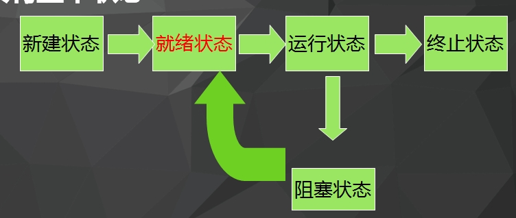

# 线程
==================================

* 线程概念
	
	* 线程是程序执行中的一个执行路径（子任务）。
	
	* 多线程是指程序中包含多条执行路径。也是指在一个进程中可同时执行两个或两个以上的线程。
	
	* 大多数程序只有一条执行路线，但现实世界中的很多过程都是同时发生的，
		对应这种情况，可编写有多条执行路径的程序，使得程序能够同时执行多个任务（并行）。
		
	* 多线程机制使得程序的多个子任务能够“同时”执行。
	
	* 线程与进程之间的联系 
	
		* 线程在进程之中，单线程即进程。但通常一个进程可拥有多个线程，其中有一个是主线程。
		
        * 线程也有进程的五种状态及状态的转换。
		  
			* 新建状态	
				
				即创建一个新的线程对象(new Thread)。当一个线程处于创建状态时，系统不为它分配资源。 	
				ThreadDemo td = new ThreadDemo();
				
			* 就绪状态	
				
					Java通过start方法启动处于新建状态的线程对象，
					使其进入就绪状态。处于就绪状态的线程已经具备了执行资格，
					将进入线程队列等待系统为其分配CPU，一旦获得了CPU，
					线程就进入运行状态，并调用自己的run方法。
					注意：cpu的切换是随机的
					td.start();

			* 运行状态
			
					处于就绪状态的线程被调度并获得CPU资源后即进运行状态，
					每一个Thread类及其子类的对象都有一个run()方法，当线程对象被调度执行的时候，
					它将自动调用本对象的run()方法。 
					注意：线程的操作应该写到run()方法中。 

			* 阻塞状态	
					* 一个正在执行的线程如果在某些特殊情况下，如被人为挂起或它的CPU时间片耗尽时，
					  将让出CPU并暂时中止自己的执行，进入阻塞状态。
					  
					* 阻塞时它不能进入排列队列，只有当引起阻塞的原因被消除时，线程才可以转入就绪状态，
					  重新进到线程队列中排队等待CPU资源，以便从原来终止处开始继续执行。 
						int i = 0;
						while(i<5) {
							long begin =System.currentTimeMillis();
							System.out.println("线程run方法"+ i);
							try {
								Thread.sleep(2000);
							} catch (InterruptedException e) {
								e.printStackTrace();
							}
							long end =System.currentTimeMillis();
							System.out.println("当次循环耗时"+((end-begin)/1000)+"秒");

							i ++;
						}
						
			* 终止状态
				当线程的运行代码全部执行完毕时，线程就进入终止状态，
				当我们执行Java线程对象的stop()方法后线也进入终止状态。
				CPU再也不会为该线程分配执行时间了。
				

		* 线程与进程都是顺序执行的指令序列。
		
	* 进程包含线程、线程构成进程

	* 线程与进程之间的区别 
	
		1. 线程的划分比进程小。 
		
		2. 进程能独立运行、父进程和子进程都有各自独立的数据空间和代码；
		   线程不能独立运行，父线程和子线程共享相同的数据空间并共享系统资源。
		   
		3. 进程是相对静止的（但相对于程序时动态的），它代表代码和数据存放的地址空间；
		   而线程是动态的，每个线程代表进程内的一个执行流。 

* 线程创建方式

	* 继承Thread
		package com.feicuiedu.demo3;

		/**
		 * Created by chenyan on 2016/9/28.
		 */
		public class ThreadDemo extends Thread {

			public static void main(String[] args) {

				ThreadDemo td = new ThreadDemo();

				td.start();

				System.out.println("main方法");
			}

			@Override
			public void run() {
				int i = 0;
				while(i<5) {
					long begin =System.currentTimeMillis();
					System.out.println("线程run方法"+ i);
					try {
						Thread.sleep(2000);
					} catch (InterruptedException e) {
						e.printStackTrace();
					}
					long end =System.currentTimeMillis();
					System.out.println("当次循环耗时"+((end-begin)/1000)+"秒");

					i ++;
				}
			}
		}

		
		
	*  实现Runable接口
	
		package com.feicuiedu.demo3;

		/**
		 * Created by chenyan on 2016/9/28.
		 */
		public class ThreadDemo1 implements Runnable {

			public static void main(String[] args) {

				ThreadDemo1 td = new ThreadDemo1();

				new Thread(td).start();

				System.out.println("main方法");
			}

			@Override
			public void run() {
				int i = 0;
				while(i<20) {
					System.out.println("线程run方法"+ i);
					i ++;
				}
			}
		}
	
