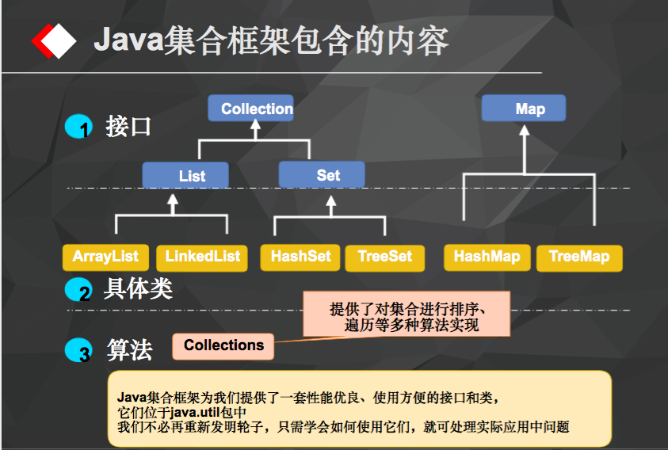
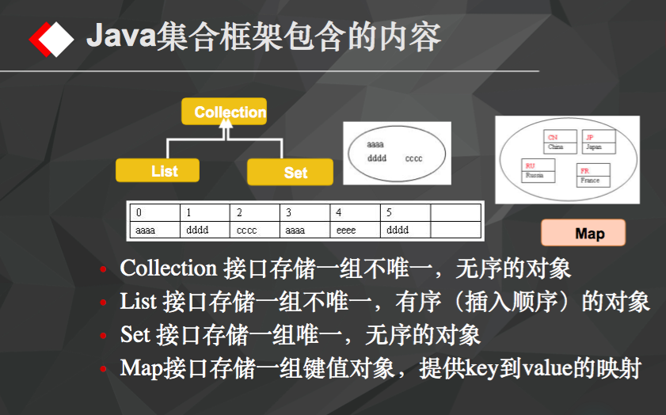

#集合的使用
===============================

* 集合类的结构图和主要用法

  
  
  
  
* 掌握方法
	
	  * 如何创建
	  
	  * 如何添加元素
	  
	  * 如何修改元素
	  
	  * 如何删除元素
	  
	  * 如何遍历 
	
* 泛型：规范类型
  	
  
*  list

	* ArrayList  可变数组
	
		import java.util.ArrayList;
		import java.util.Iterator;
		import java.util.List;

		/**
		 * Created by chenyan on 2016/9/27.
		 */
		public class ListDemo {

			public static void main(String[] args) {

				// 创建
				List<String> list = new ArrayList<String>();

				// 添加
				list.add("毛泽东");

				list.add("周恩来");

				list.add("刘少奇");

				list.add(2,"朱德");

				// list.add("林彪");

				//  修改
				// list.set(0,"林彪");

				// 删除
				// list.remove(0);
				list.remove("毛泽东");

				// 查询遍历
				for(int index = 0;index< list.size();index ++) {
					String name = list.get(index);
					System.out.println(name);
				}

				System.out.println("*******************************");
				for (String name : list) {
					System.out.println(name);
				}

				System.out.println("*******************************");
				Iterator<String> it = list.iterator();
				while(it.hasNext()) {
					String name = it.next();
					System.out.println(name);
				}
			}
		}

	
	* LinkedList 链表
	
		* 在集合任何位置（头部、中间、尾部）添加、获取
		
		* 插入、删除操作频繁时，可使用LinkedList来提高效率
		
		* LinkedList还额外提供对头部和尾部元素进行添加和删除操作的方法 
		
		import java.util.ArrayList;
		import java.util.Iterator;
		import java.util.LinkedList;
		import java.util.List;

		/**
		 * Created by chenyan on 2016/9/27.
		 */
		public class LinkedListDemo {

			public static void main(String[] args) {

				// 创建
				LinkedList<String> list = new LinkedList<>();

				// 添加
				list.add("毛泽东");

				list.add("周恩来");

				list.add("刘少奇");

				list.add(2,"朱德");

				// list.add("林彪");

				//  修改
				// list.set(0,"林彪");

				// 删除
				// list.remove(0);
				list.remove("毛泽东");

				list.addFirst("陈独秀");
				list.addLast("华国锋");
				// 查询遍历
				for(int index = 0;index< list.size();index ++) {
					String name = list.get(index);
					System.out.println(name);
				}

				System.out.println("*******************************");
				for (String name : list) {
					System.out.println(name);
				}

				System.out.println("*******************************");
				Iterator<String> it = list.iterator();
				while(it.hasNext()) {
					String name = it.next();
					System.out.println(name);
				}
			}
		}

* set
	
	* Set接口也是Collection接口的子接口，但是与Collection或List接口不同的是，Set接口中不能加入重复的元素。
	
	* Set接口的定义： public interface Set<E> extends Collection<E>
	
	* Set接口的主要方法与Collection是一致的 
	
	* Set接口的实例无法像List接口那样进行双向输出
	
	* Set接口的常用子类 
	
		* HashSet (散列的存放) :
		  
		  HashSet是Set接口的一个实现类，
		  主要的特点是：
			里面不能存放重复元素，
			采用散列的存储方式，所以是没有顺序(插入顺序)的。 
			
			
		import java.util.HashSet;
		import java.util.Iterator;
		import java.util.LinkedList;

		/**
		 * Created by chenyan on 2016/9/27.
		 */
		public class HashSetDemo {

			public static void main(String[] args) {

				// 创建
				HashSet<String> list = new HashSet<String>();

				// 添加
				list.add("毛泽东");

				list.add("周恩来");

				list.add("刘少奇");

				// list.add("林彪");

				//  修改
				// list.set(0,"林彪");

				// 删除
				// list.remove(0);
				// list.remove("毛泽东");

				// 查询遍历

				for (String name : list) {
					System.out.println(name);
				}

				System.out.println("*******************************");
				Iterator<String> it = list.iterator();
				while(it.hasNext()) {
					String name = it.next();
					System.out.println(name);
				}
			}
		}
		
		* TreeSet (有序的存放) :
		
			输入的数据进行有序排列

			import java.util.Iterator;
			import java.util.TreeSet;

			/**
			 * Created by chenyan on 2016/9/27.
			 */
			public class TreeSetDemo {

				public static void main(String[] args) {

					// 创建
					TreeSet<String> list = new TreeSet<String>();

					// 添加
					list.add("b毛泽东");

					list.add("a周恩来");

					list.add("c刘少奇");

					// list.add("林彪");

					//  修改
					// list.set(0,"林彪");

					// 删除
					// list.remove(0);
					// list.remove("毛泽东");

					// 查询遍历

					for (String name : list) {
						System.out.println(name);
					}

					System.out.println("*******************************");
					Iterator<String> it = list.iterator();
					while(it.hasNext()) {
						String name = it.next();
						System.out.println(name);
					}
				}
			}

	
    
	  
	  
